# Create and Deploy a Form Recognizer Custom Model

### Overview
In this lab, you will create (train) an Azure Form Recognizer custom model using a sample training dataset. Custom models extract and analyze distinct data and use cases from forms and documents specific to your business. To create a custom model, you label a dataset of documents with the values you want to extract and train the model on the labeled dataset. You only need five examples of the same form or document type to get started. For this lab, you will use the dataset provided at [Custom Model Sample Files](/SampleInvoices/Custom%20Model%20Sample/).

### Goal
* Use a sample training data set to train a custom model in the Azure Form Recognizer Studio.
* Label the training data documents with custom fields of interest.
* Test the trained model on test data, visualized results, and confidence scores in the studio.
* Use the custom model in the BPA pipeline.

### Pre-requisites
* The accelerator is deployed and ready in the resource group.
* You have an Azure subscription and permission to create a Form Recognizer Resource.
* You have access to the sample invoices folder with the invoices to upload.

### Instructions

### Task 1: Creating a Form Recognizer Resource

In this task, we will create and configure a Form Recognizer resource in Azure, set up a custom project, and connect it to a new storage account for training data.

1. Go to the Resource group, search, and select the **Azure AI services multi-service account** resource type with a name similar to **cogservicesbpa{suffix}**.

   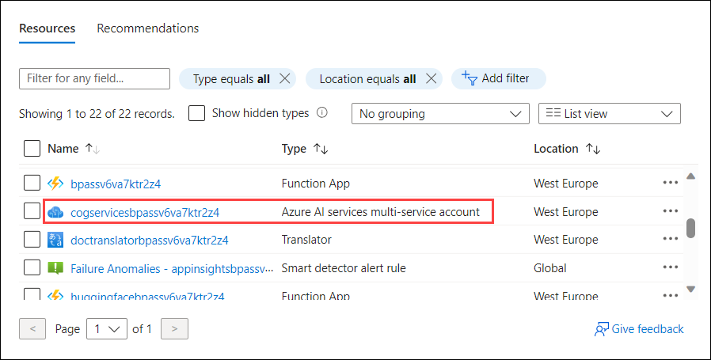

2. Click on the **Document Intelligence (1)** tab and select **Go to studio (2)**.

   .png)

3. In Document Intelligence Studio, scroll down to Custom Models and choose **Get started**.

   .png)

   >**Note:** If a pop-up appears prompting you to sign in, please use the credentials provided on the environment details page.

5. Under My Project, click on **+ Create a project**.

   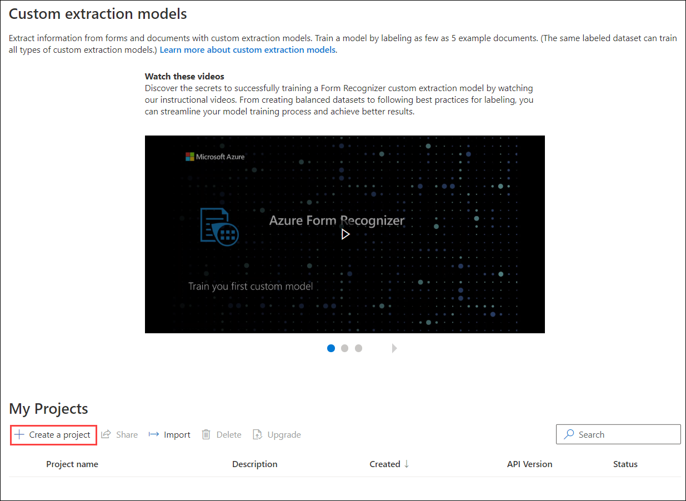

6. Enter the following details and click on **Continue**  **(3)**.
    
   - Project name: **testproject** **(1)**.
   - Description: **Custom model project** **(2)**.

     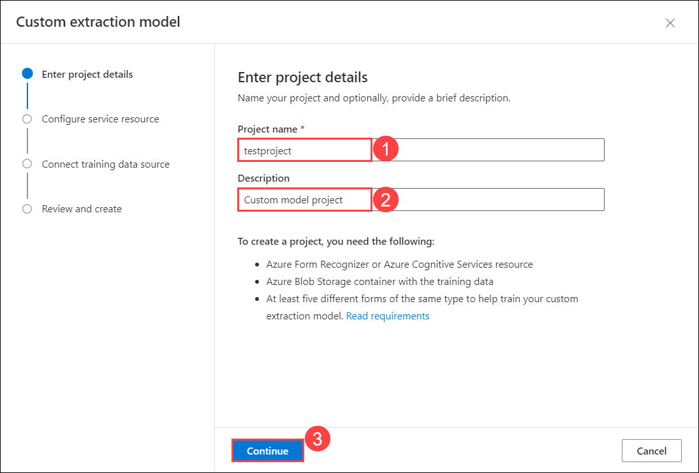

7. Enter the following details **Configure service resource** and click on **Continue** **(5)**.

   - Subscription: Select your **Default Subscription** **(1)**.
   - Resource group: **business-process-<inject key="Deployment ID" enableCopy="false"/>** **(2)**.
   - Form Recognizer or Cognitive Service Resource: Select the available Cognitive Service Form Recognizer name similar to **cogservicesbpass{suffix}** **(3)**.
   - API version: **2022-08-31 (3.0 General Availability)** **(4)**.

     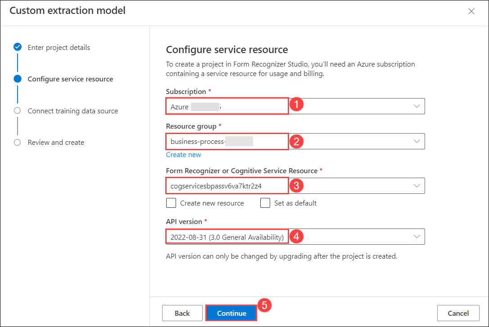

8. Enter the following details **Connect training data source** and click on **Continue** **(8)**.

   - Subscription: Select your **Default Subscription** **(1)**.
   - Resource group: **business-process-<inject key="Deployment ID" enableCopy="false"/>** **(2)**.
   - Check the box to **Create new storage account** **(3)**
   - Storage account name: **formrecognizer<inject key="Deployment ID" enableCopy="false"/>** **(4)**.
   - Location: **East US** **(5)**.
   - Pricing tier: **Standard_LRS Standard** **(6)**.
   - Blob container name: **custommoduletext** **(7)**.
   
        

9. Validate the information and choose **Create project**.

     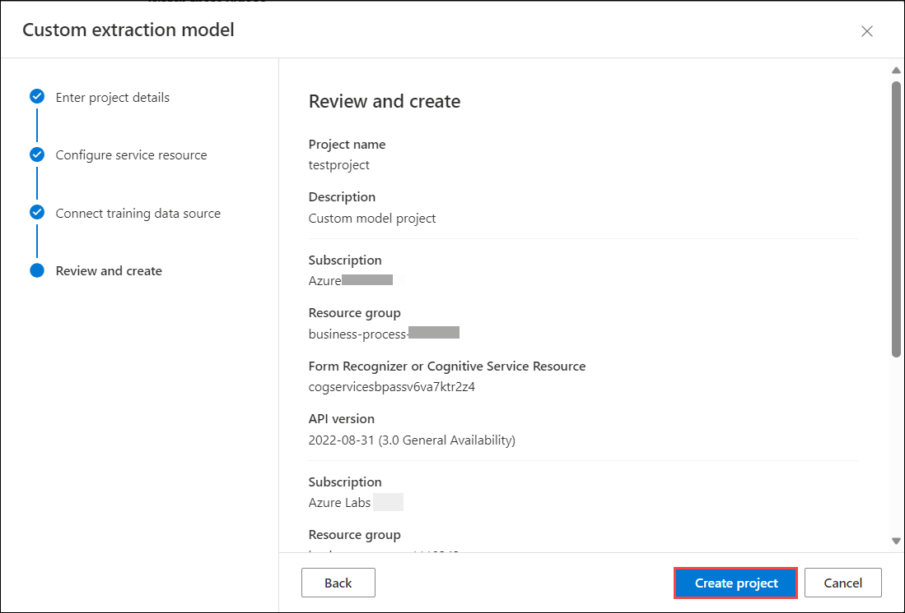

### Task 2: Train and Label data

In this task, you will upload 6 training documents to train and 2 test documents to test the model.

1. Click on **Browse for files**.

     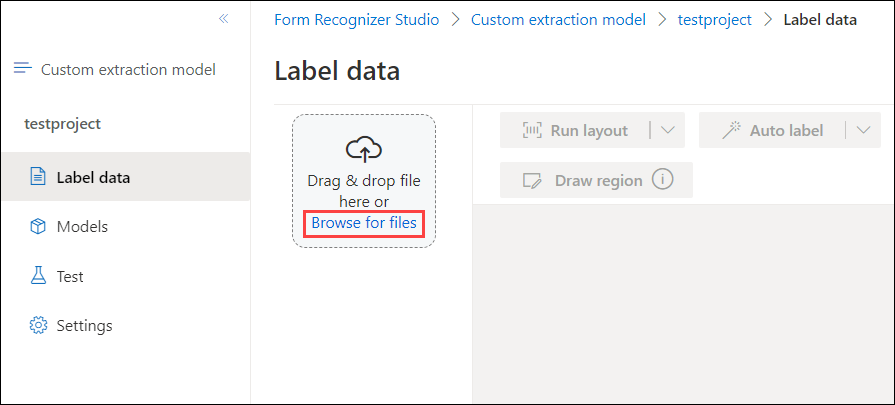

2.  On the file explorer, enter the following `C:\Users\Public\Desktop\Data\Custom Model Sample` **(1)** path hit **enter**, select all train JPEG files **train1 to train6** **(2)**, and hit **Open** **(3)**.

     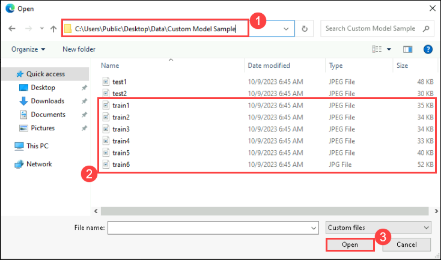

3. Once uploaded, choose **Run now** in the pop-up window under Run Layout.

     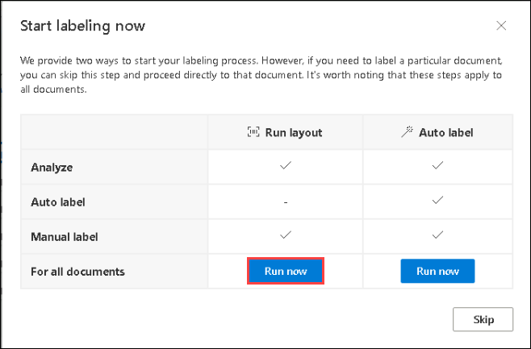

4. Click on **+ Add a field** **(1)**, select **Field** **(2)**, enter the field name as **Organization_sample** **(3)** and hit **enter**.

     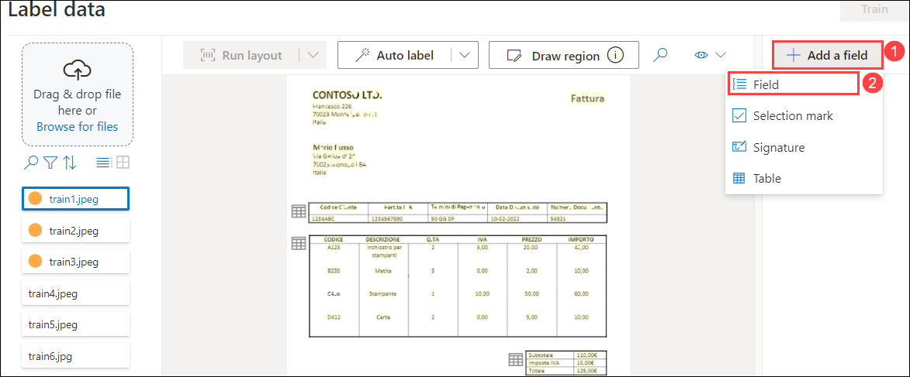

     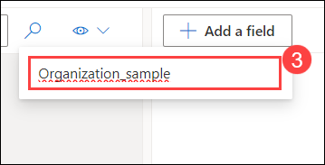

5. Label the new field added by selecting **CONTOSO LTD** in the top left of each document uploaded. Do this for all six documents.

     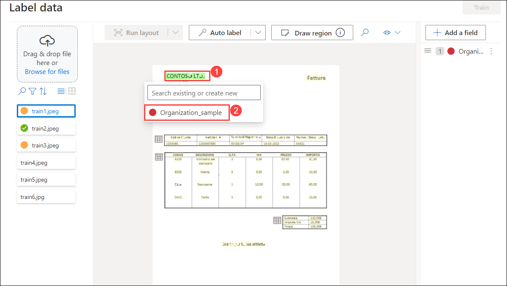

6. Once all the documents are labeled, click on **Train** in the top right corner.

     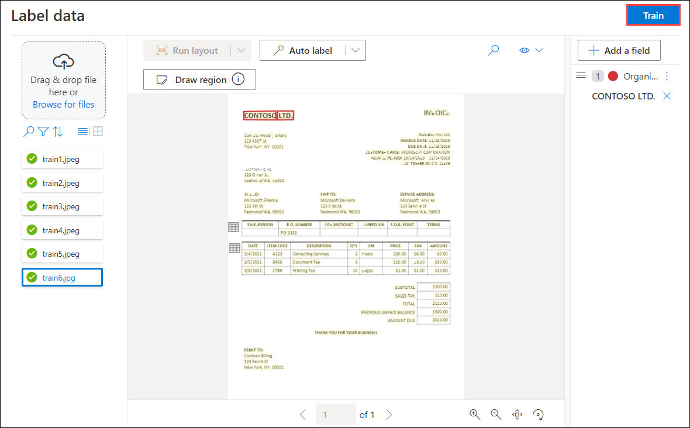

7. Specify the model ID as **customfrs** **(1)**, Model Description as **custom model** **(2)**, from the drop-down select **Template** **(3)** as Build Mode and click on **Train** **(4)**.

     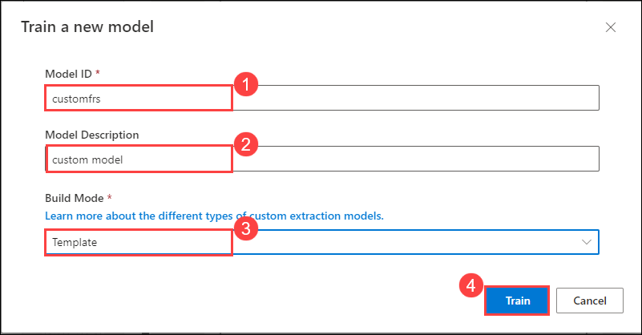

8. Click on **Go to Models**. 

   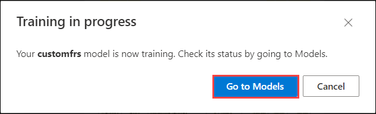

9. Wait till the model status shows **succeeded** **(1)**. Once the status Select the model **customfrs** **(2)** you created and choose **Test** **(3)**.

     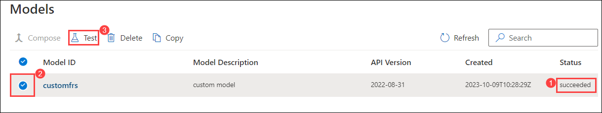

10. On the Test model window, click on **Browse for files**. 

     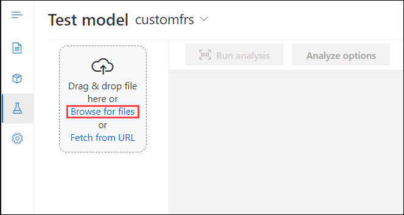

11. On the file explorer, enter the following `C:\Users\Public\Desktop\Data\Custom Model Sample` **(1)** path hit **enter**, select all test JPEG files **test1 and test2** **(2)**, and hit **Open** **(3)**.

     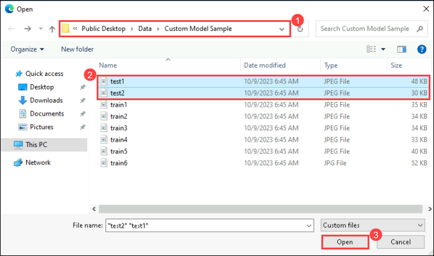

12. Once uploaded, select one test model, and click on **Run analysis** **(1)**, Now you can see on the right-hand side that the model was able to detect the field **Organization_sample** **(2)** we created in the last step along with its confidence score.

     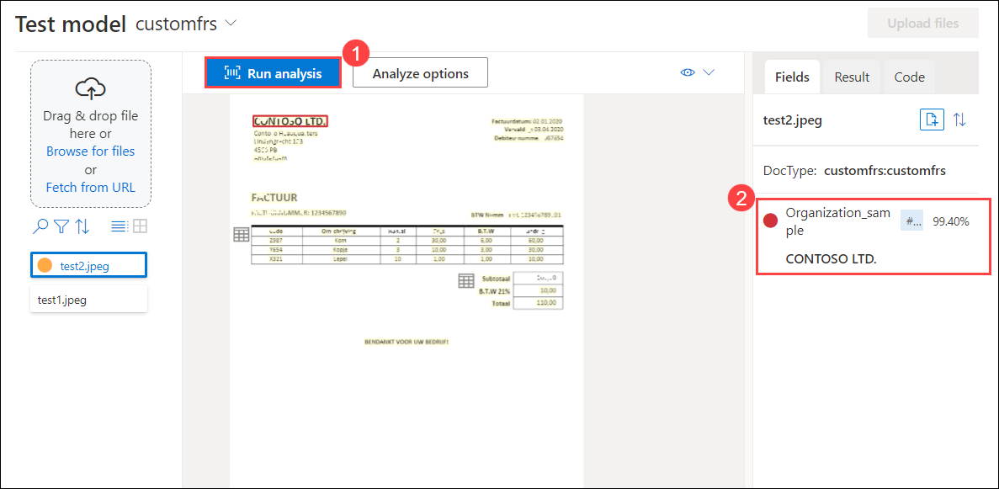

### Task 3: Build a new pipeline with the custom model module in BPA

After you are satisfied with the custom model performance, you can retrieve the model ID and use it in a new BPA pipeline with the Custom Model module in the next step.

1. Navigate back to the Resource groups and select the resource group **business-process -<inject key="Deployment ID" enableCopy="false"/>**.

    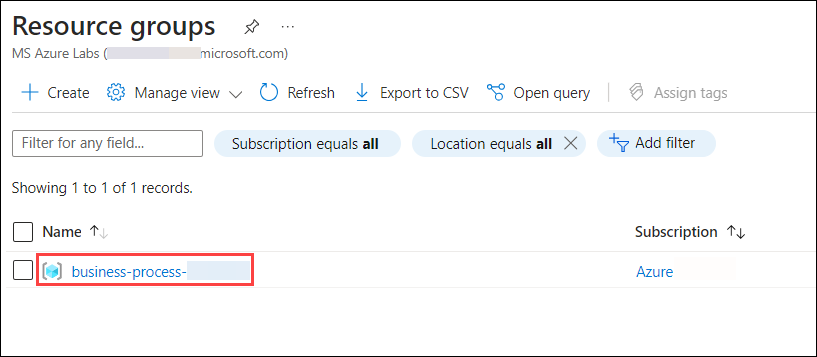

2. Go to the Resource group, search, and select the **Static Web App** resource type with the name similar to **webappbpa{suffix}**.

   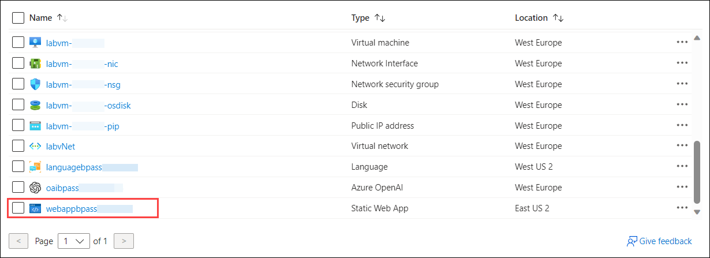

3. On the **Static Web App** page, click on **View app in browser**.

      

4. Once the **Business Process Automation Accelerator** page loaded successfully, click on the **Create/Update/Delete Pipelines**. 

   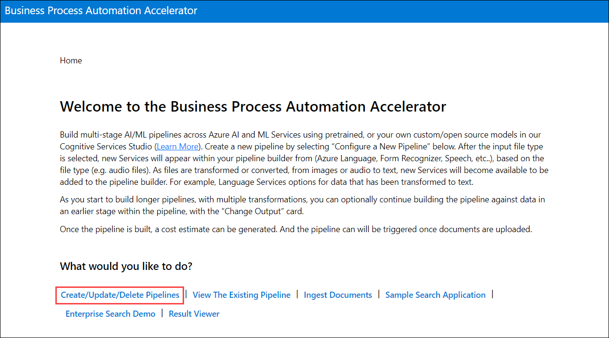

5. On the **Create Or Select A Pipeline** page, enter New Pipeline Name as **workshop** **(1)**, and click on the **Create Custom Pipeline** **(2)**. 

   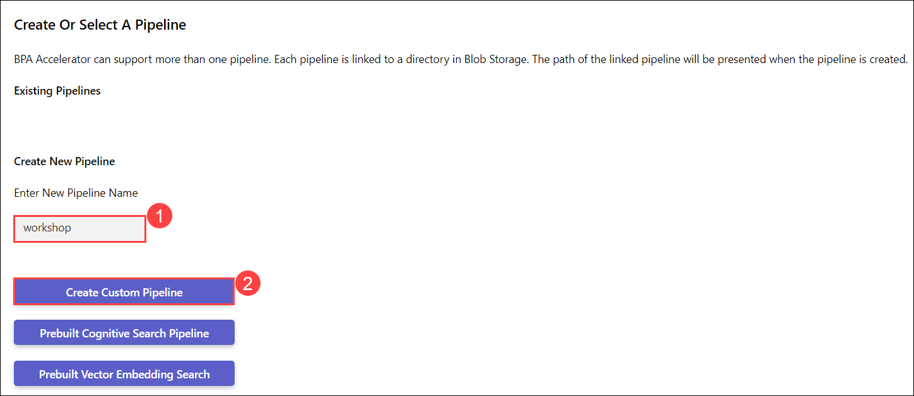

6. On the **Select a document type to get started** page, select **PDF Document**

   

7. On the **Select a stage to add it to your pipeline configuration** page, search and select for **Form Recognizer Custom Model (Batch)**.

   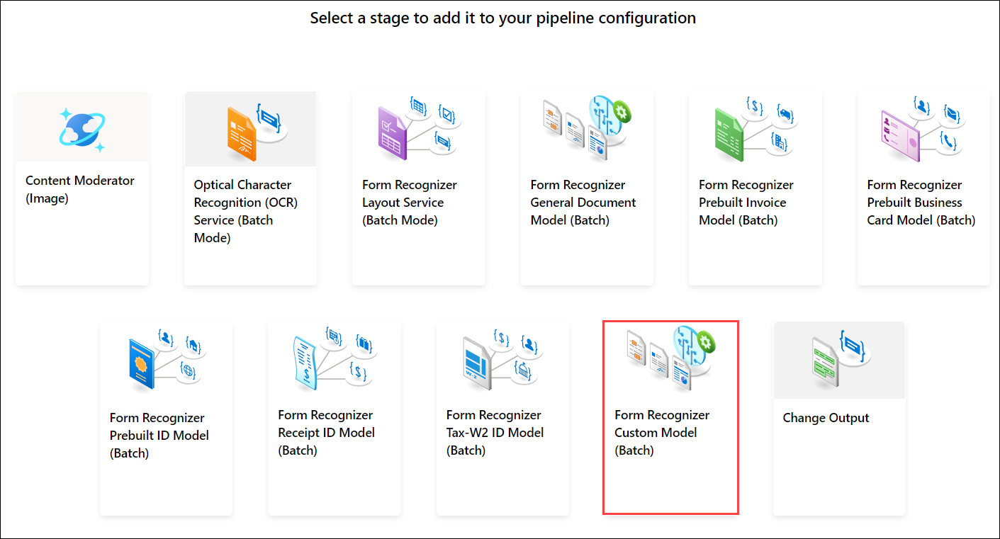

8. On the pop-up, enter the Model ID as **customfrs** **(1)** and click on **Submit** **(2)**. 

   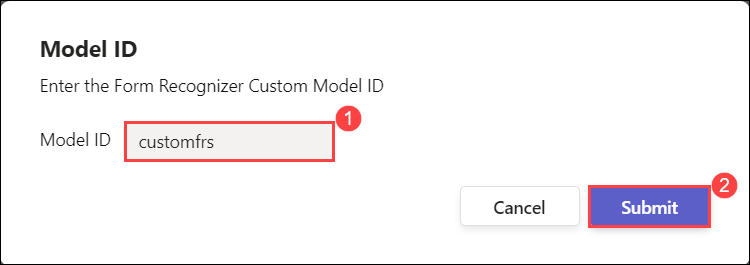

9. On the **Select a stage to add it to your pipeline configuration** page, scroll down to review the **Pipeline Preview**, and click on **Done**.

   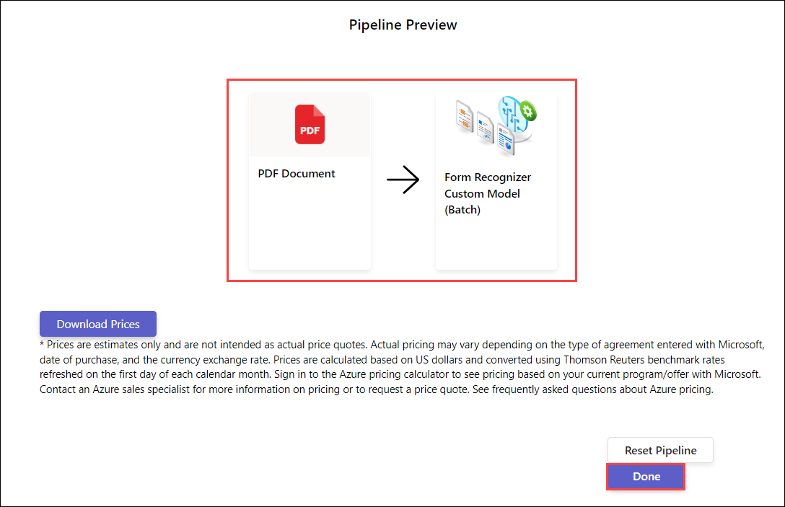

10. On the **Piplelines workshop** page, click on **Home**. 

      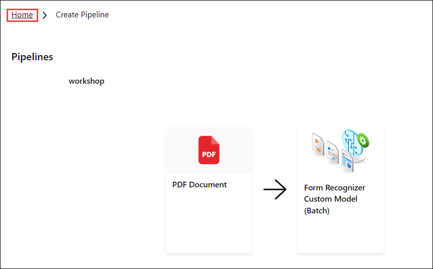

11. On the **Business Process Automation Accelerator** page, click on **Ingest Documents**.

      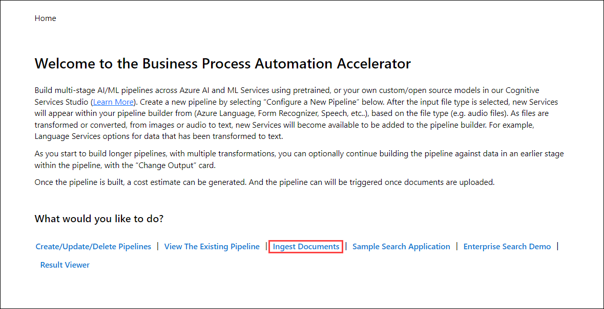

12. On the **Upload a document to Blob Storage** page, from the drop-down select a Pipeline with the name **workshop** **(1)**, and click on **Upload or drop a file right here**.

      

13. For documents, enter the following `C:\Users\Public\Desktop\Data\Lab 1 Step 3.7` **(1)** path and hit enter. You can upload multiple invoices one by one.

      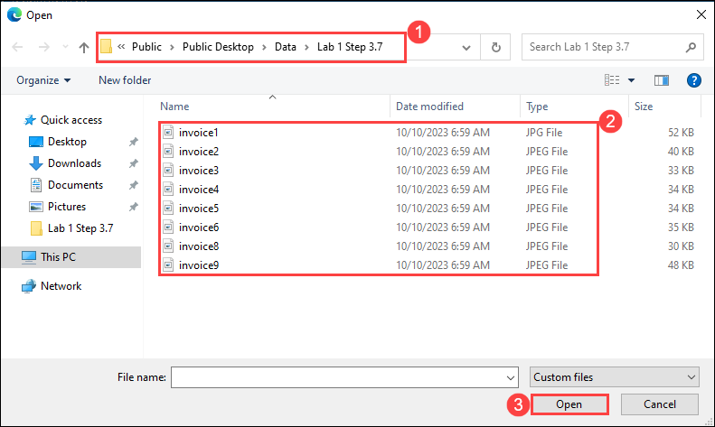

### Task 4: Configure Azure Cognitive Search 

In this task, we will configure Azure Cognitive Search to connect to an Azure Blob Storage data source, create an index, and set up an indexer to process and search the data.

1. Navigate back to the resource group window, search, and select **Search Service** with a name similar to **bpa{suffix}**.

   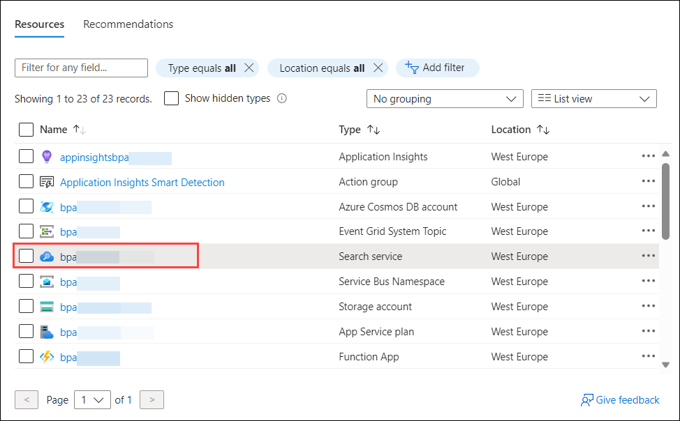

2. On the **Search service** page, click on **Import data**.

   .png)

3. Enter the following details for **Connect to your data**.

   - Data Source: Select **Azure Blob Storage** **(1)**
   - Data Source Name: Enter **workshop** **(2)**.
   - Parsing mode: Select **JSON** **(3)**.
   - Click on **Choose an existing connection** **(4)** under Connection string.
  
     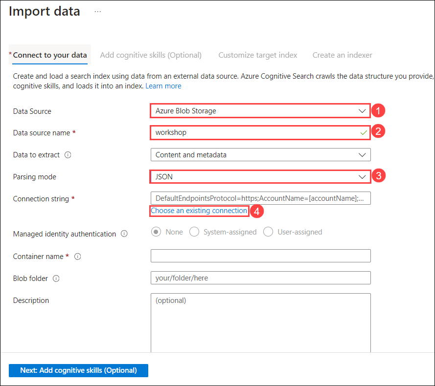

4. On the **Storage accounts** page, select the storage account named similar to **bpass{suffix}**. 

     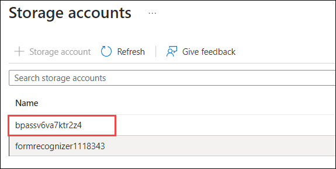

5. Select **results** **(1)** container from the **Containers** page and click on **Select** **(2)**. It will redirect back to **Connection to your data** page.

     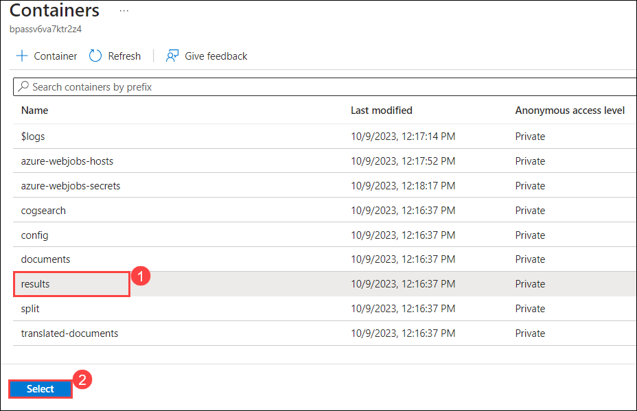   
  
6. On the **Connect to your data** page, enter the **workshop** **(1)** as **Blob folder** and click on **Next: Add cognitive skills (Optional) (2)**.

   .png)

7. On the **Add cognitive skills (Optional)** click on **Skip to : Customize target index**.

8. On the **Customize target index**, enter Index name as **azureblob-index** **(1)**, make all fields **Retrievable** **(2)**, and **Searchable** **(3)**.

      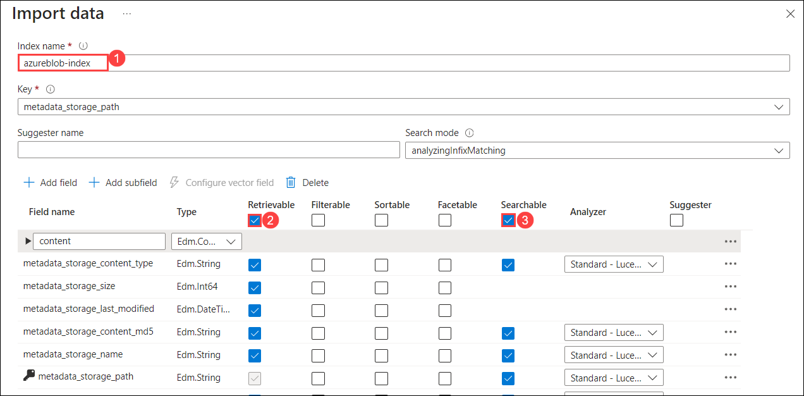

9. Expand the **aggregatedResults** **(1)** > **customFormRec** **(2)** > **documents** **(3)** > **fields** **(4)** under it, expand **Organization_sample (5)**. Make the three fields Facetable **(type, valueString & content)** **(6)** and click on **Next: Create an indexer** **(7)**.

      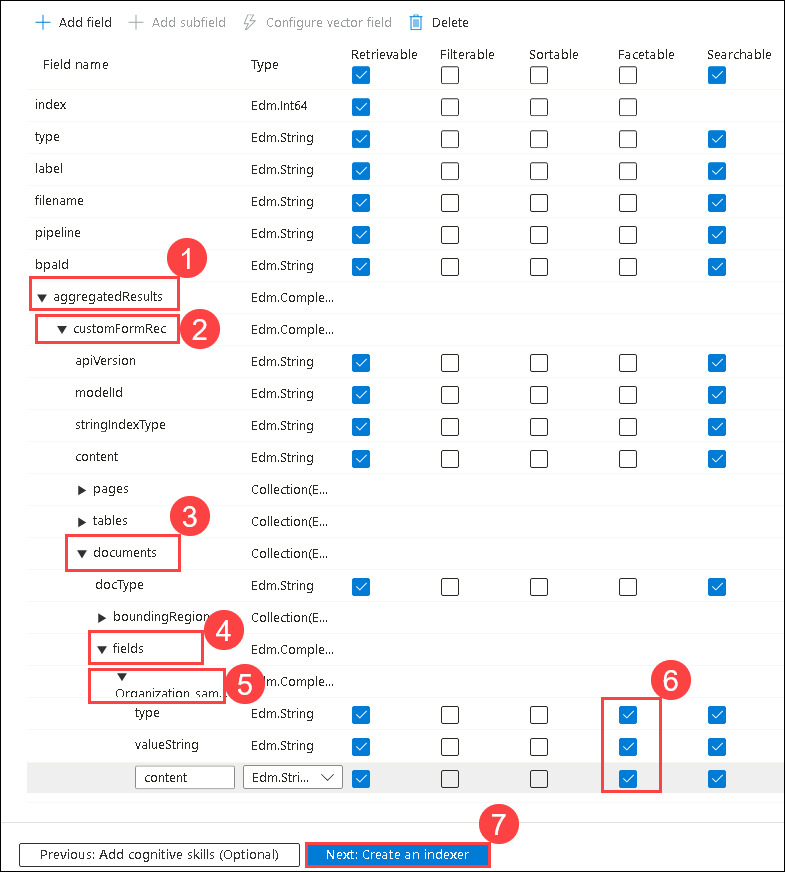

7. On the **Create an indexer** page, enter the name as **azureblob-indexer** **(1)** and click on **Submit** **(2)**.
   
   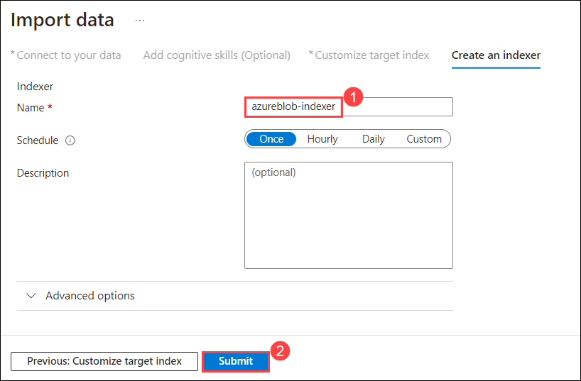

## Summary

In this lab, you have accomplished the following:

* Use a sample training data set to train a custom model in the Azure Form Recognizer Studio.
* Label the training data documents with custom fields of interest.
* Test the trained model on test data, visualized results, and confidence scores in the studio.
* Use the custom model in the BPA pipeline.

## More Resources

**Getting Started with Form Recognizer Studio**: https://learn.microsoft.com/en-us/azure/applied-ai-services/form-recognizer/form-recognizer-studio-overview?view=form-recog-3.0.0  
**Form Recognizer Documentation**: https://learn.microsoft.com/en-us/azure/applied-ai-services/form-recognizer/concept-invoice?view=form-recog-3.0.0
