# Use Azure OpenAI with your own data

### Overview
In this lab, you will be using your own data with Azure OpenAI Large Language Models (LLM), which will be made searchable using Azure Cognitive Search. You will be using the Porche Owner's Manual pdf provided under the [Lab 2](/SampleInvoices/Lab%202/) folder.

### Goal
* How to leverage the ChatGPT LLM to extract a concise summary from your own document repository using OpenAI.

### Pre-requisites
* Access to Azure OpenAI chat playground.
* Sample data to test with OpenAI.

### Instructions

### Task 1: Navigate to Azure OpenAI Playground

1. Navigate back to the Resource groups and select the resource group **business-process-<inject key="Deployment ID" enableCopy="false"/>**.

   

2. On the Resource group, search, and select the **Azure OpenAI** resource type with a name similar to **oaibpa{suffix}**.

   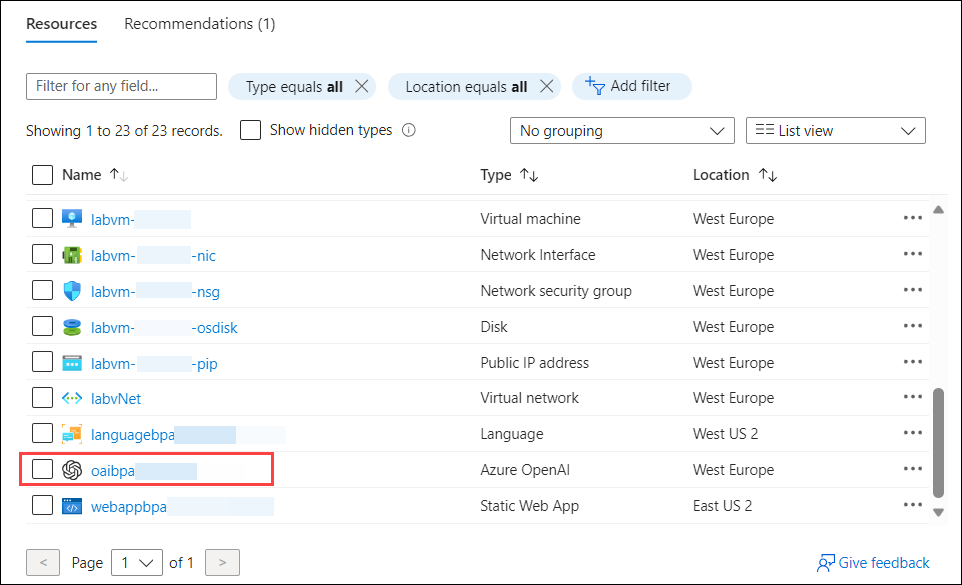

3. On the **Azure OpenAI** page, click on **Go to Azure OpenAI Studio**.

   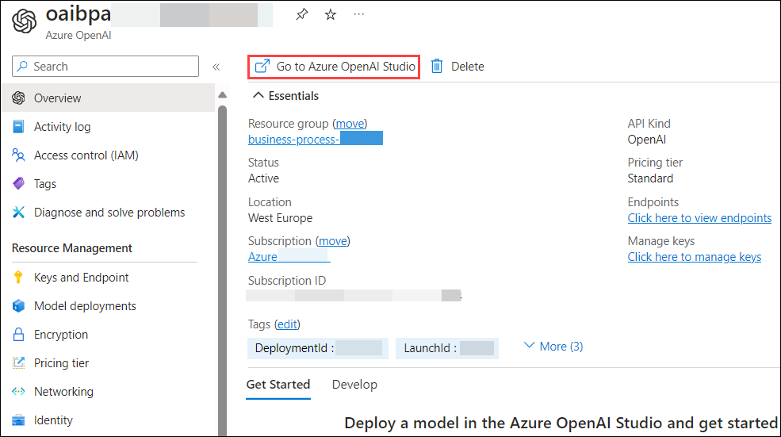

4. On the **Azure OpenAI Studio**, scroll down click on **Bring your own data**.

   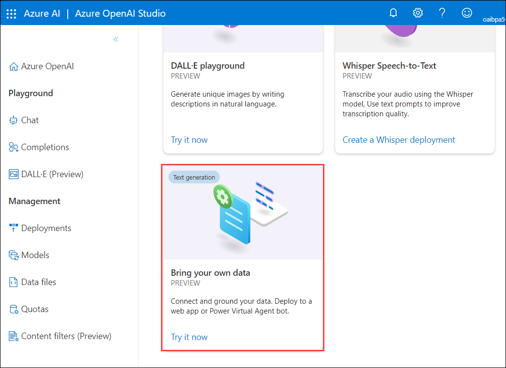

### Task 2: Upload your own data

In this step, we will be using Porche's owner manual for the Taycan, Panamera, and Cayenne models.

1. Fill the following details in **Select or add data source** and click on **Next** **(7)**.
    
    - Select data source: **Upload files** **(1)**

    - Subscription: Select your subscription from the drop-down section **(2)**

    - Select Azure Blob storage resource: Choose the already created storage account from the drop-down **(3)**. If asked, enable CORS.

    - Select Azure Cognitive Search resource: Select the search service used in the previous lab from the drop-down **(4)**.

    - Enter the index name: Give an index name as **aoaiworkshop** **(5)**

    - Check the **I acknowledge that connecting to an Azure Cognitive Search account will incur usage to my account** **(6)**.

      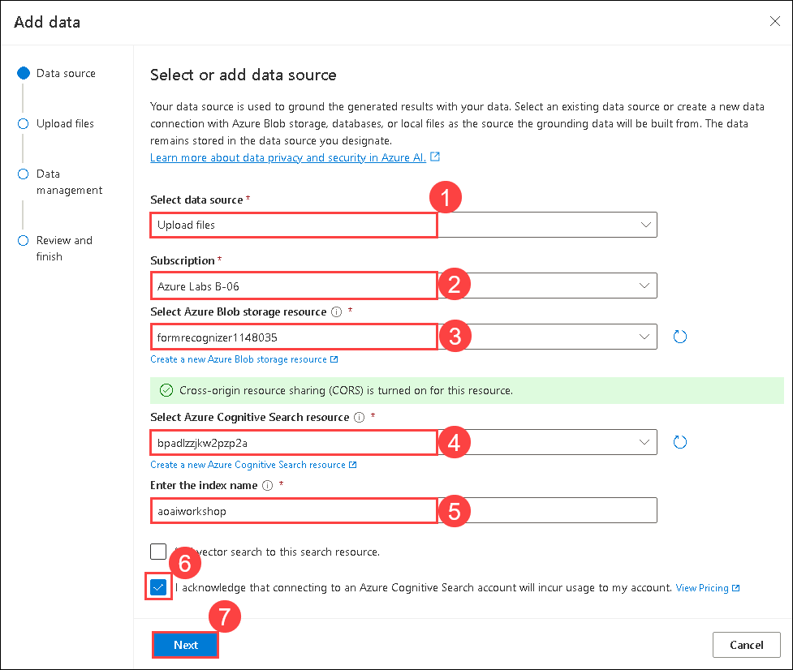 

2. On the **Data Management**, click on **Browse for a file** **(1)** enter the following `C:\Users\Public\Desktop\Data\Lab 2` **(2)** path and hit enter, select the **Panamera-from-2021-Porsche-Connect-Good-to-know-Owner-s-Manual** **(3)** pdf  file and click on **Open** **(4)** files.

   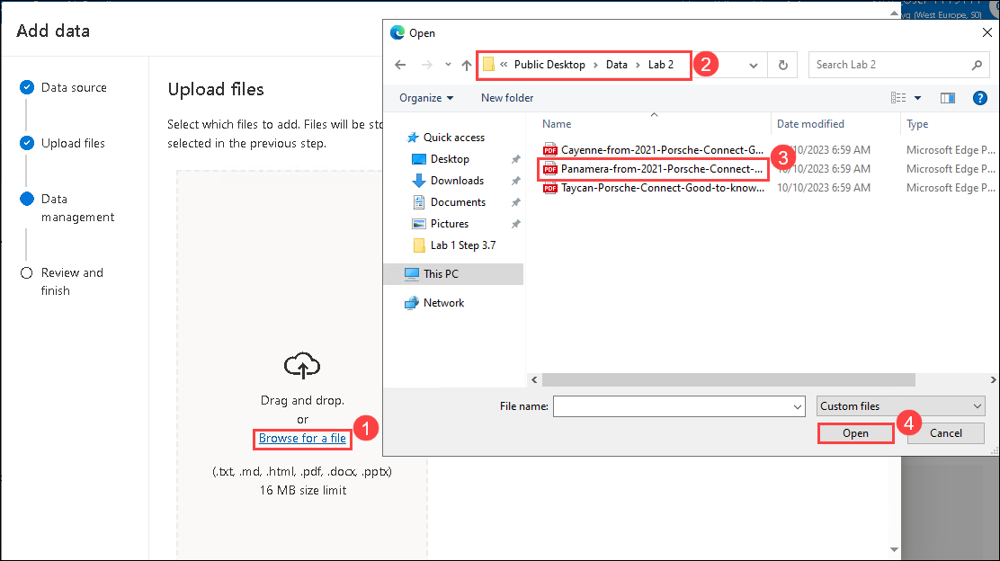

3. It will redirect to **Data management**, click on **Upload files** **(1)**, and click on **Next** **(2)**.

   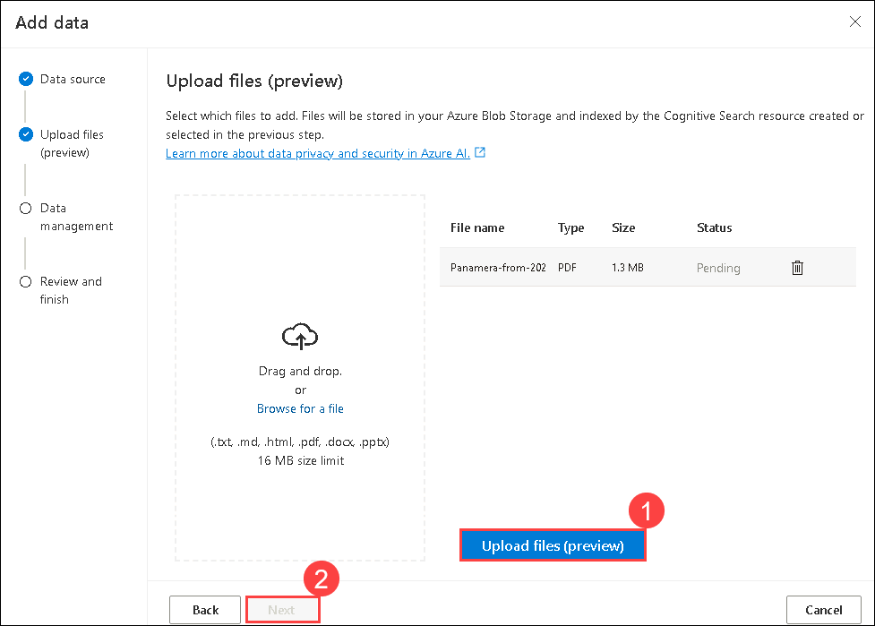

4. On the **Data Management** page, from the drop-down select **keyword (1)** as Search type and click on **Next (2)**.

   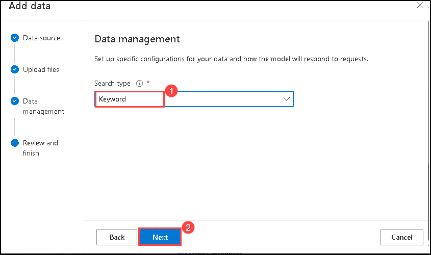

5. On the **Review and finish** page, click on **Save and close**.

   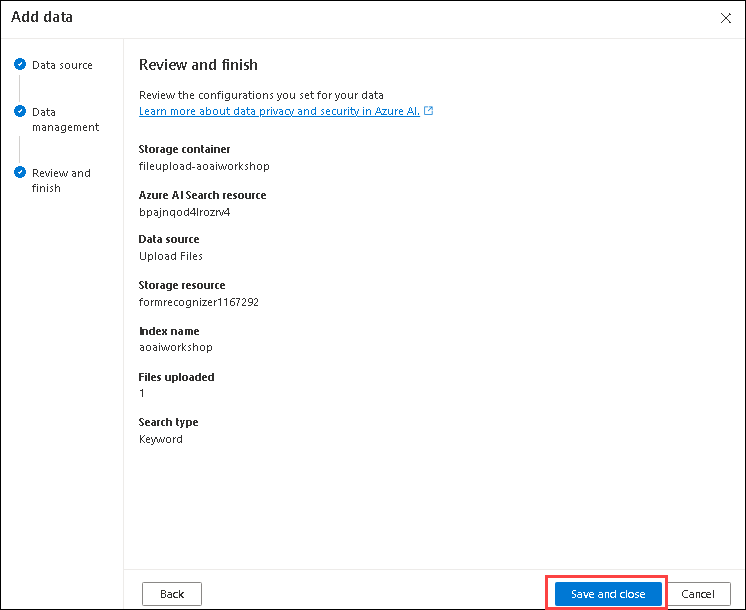

### Task 3: Interact with Azure OpenAI ChatGPT LLM using your own data

1. Under the **Assistant Setup** pane, wait until your data upload is finished.

   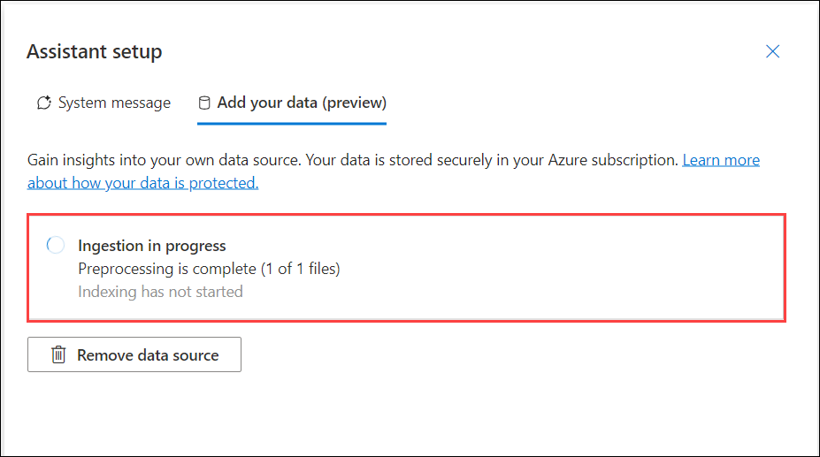

   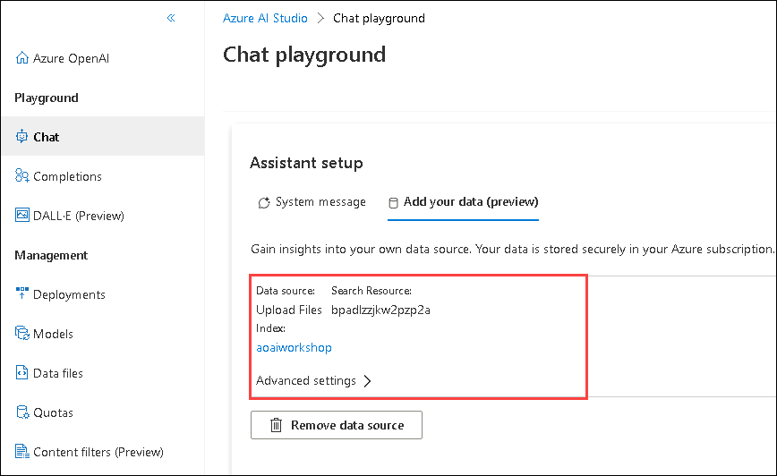

2. Under the **Chat Session** pane, you can start testing out your prompts by entering the query like this.

    ```
    how to operate Android Auto in Porche Taycan? give step-by-step instructions
    ```

      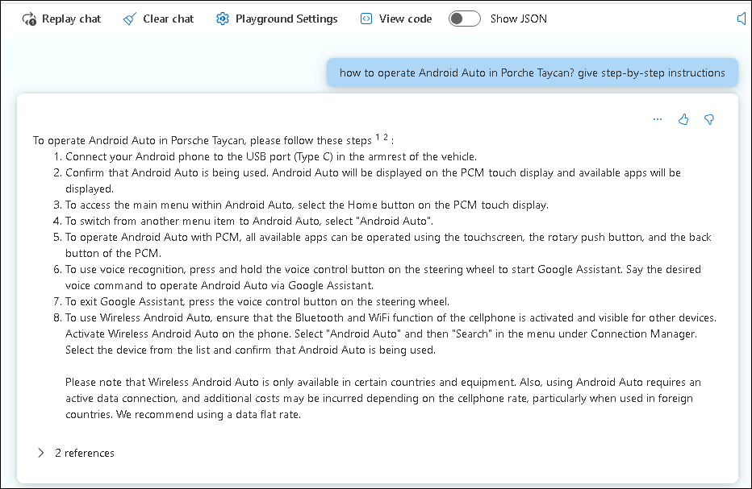

3. You can also configure the responses of your bot by selecting the system message under **Setup**, and click on **Prompt** **(1)** to replace the value under the system message with `Your name is Alice. You are an AI assistant that helps people find information about Porche cars. Your responses should not contain any harmful information` **(2)** and click on **Apply changes** **(3)**. Here we have edited the default system message.

   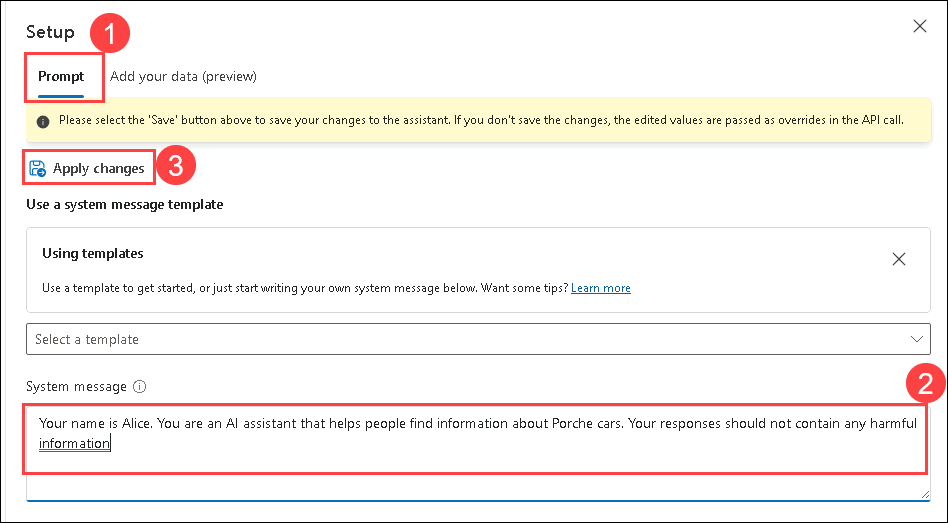

4. On **Update system message?** pop-up, click on **Continue**.

   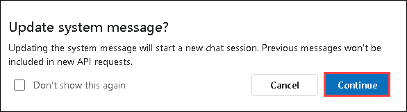

5. Under the **Chat Session** pane, you can start testing out your prompts by entering the query like this.

    ```
     What is your name
    ```
   
   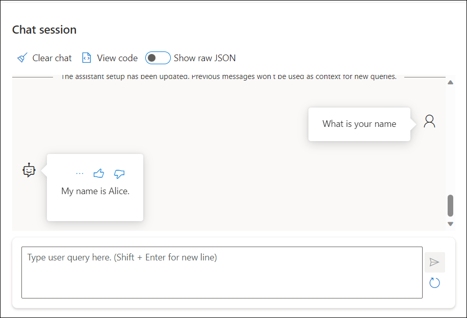

6. In the **Configuration** pane, click on **Parameters**. You can try and experiment with different parameter configurations to see how they change the behavior of the model.

    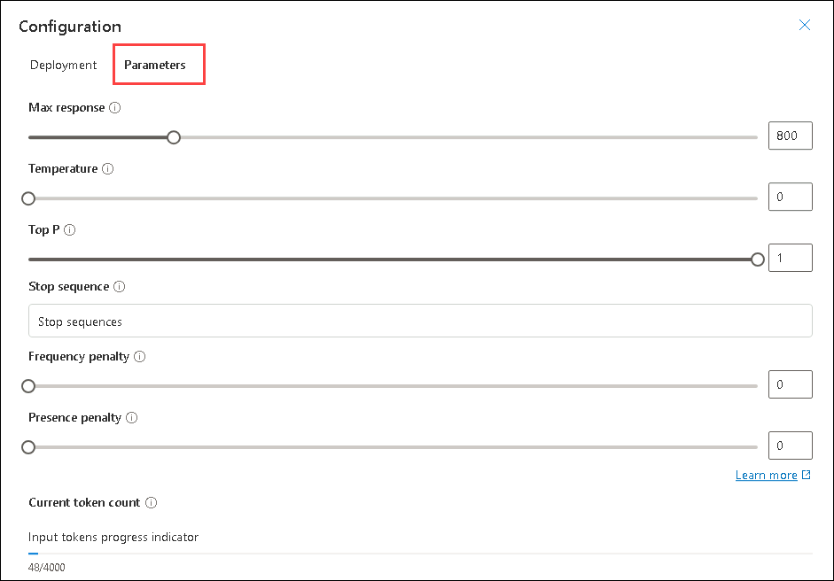

## Review

In this lab, you have accomplished the following:

* How to leverage the ChatGPT LLM to extract a concise summary from your own document repository using OpenAI.


## You have successfully completed the lab.
