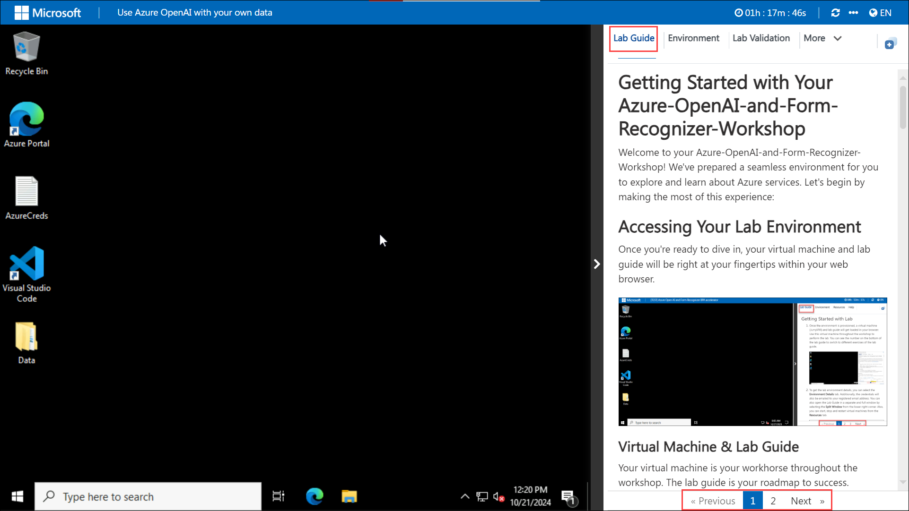
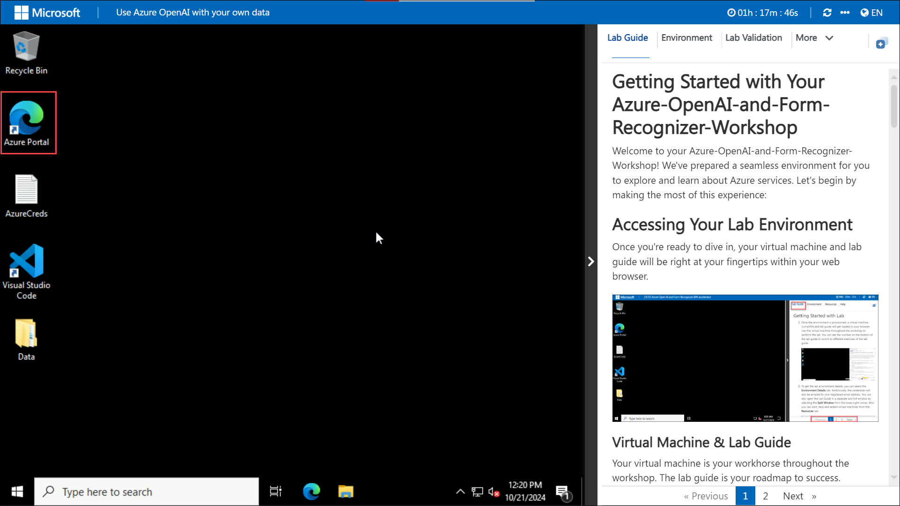
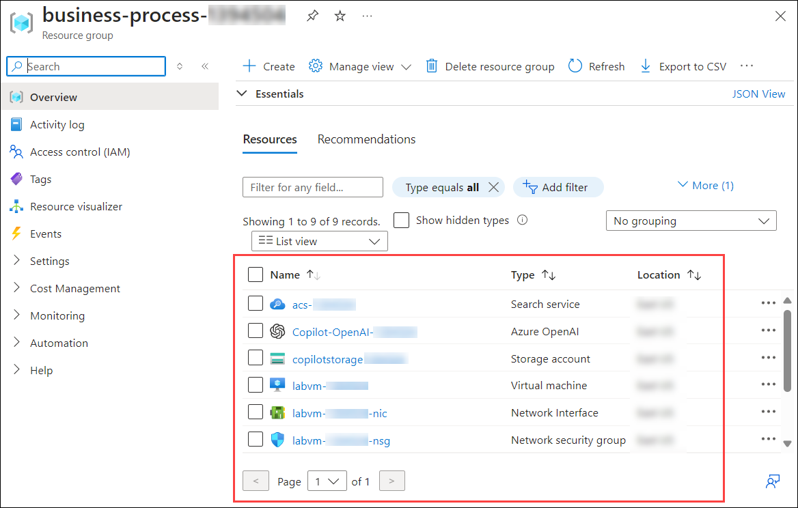

# **Getting Started with Your Azure-OpenAI-and-Form-Recognizer-Workshop**
 
Welcome to your Azure-OpenAI-and-Form-Recognizer-Workshop! We've prepared a seamless environment for you to explore and learn about Azure services. Let's begin by making the most of this experience:
 
## **Accessing Your Lab Environment**
 
Once you're ready to dive in, your virtual machine and lab guide will be right at your fingertips within your web browser.

  

### **Virtual Machine & Lab Guide**
 
Your virtual machine is your workhorse throughout the workshop. The lab guide is your roadmap to success.
 
## **Exploring Your Lab Resources**
 
To get a better understanding of your lab resources and credentials, navigate to the **Environment** tab.
 
  .png)
 
## **Utilizing the Split Window Feature**
 
For convenience, you can open the lab guide in a separate window by selecting the **Split Window** button from the Top right corner.
 
  .png)
 
## **Managing Your Virtual Machine**
 
Feel free to start, stop, or restart your virtual machine as needed from the **Resources** tab. Your experience is in your hands!

  

## Lab Validation

1. After completing the task, hit the **Validate** button under Validation tab integrated within your lab guide. If you receive a success message, you can proceed to the next task, if not, carefully read the error message and retry the step, following the instructions in the lab guide.

   

1. You can also validate the task by navigating to the **Lab Validation** tab, from the upper right corner in the lab guide section.

   

1. If you need any assistance, please contact us at labs-support@spektrasystems.com.
 
## **Let's Get Started with Azure Portal**
 
1. On your virtual machine, click on the **Azure Portal** icon as shown below:
 
    

1. On the **Sign in to Microsoft Azure** tab you will see the login screen, in that enter the following email/username, and click on **Next**. 

   * **Email/Username**: <inject key="AzureAdUserEmail"></inject>
   
      
     
1. Now enter the following password and click on **Sign in**.
   
   * **Password**: <inject key="AzureAdUserPassword"></inject>
   
      

1. If **Action required** pop-up window appears, click on **Ask later**.

   
     
1. If you see the pop-up **Stay Signed in?**, select **No**.

1. If you see the pop-up **You have free Azure Advisor recommendations!**, close the window to continue the lab.

1. If a **Welcome to Microsoft Azure** popup window appears, select **Maybe Later** to skip the tour.
   
1. Now you will see the Azure Portal Dashboard, click on **Resource groups** from the Navigate panel to see the resource groups.

   
   
1. Confirm that you have all **business-process-<inject key="Deployment ID" enableCopy="false"/>** resource groups present as shown below.

   
   
1. Verify the resources deployed in the **business-process-<inject key="Deployment ID" enableCopy="false"/>** resource group.

   
   
1. Now, click on **Next** from the lower right corner to move on to the next page.
 
Now you're all set to explore the powerful world of technology. Feel free to reach out if you have any questions along the way.

### Support Contact
The CloudLabs support team is available 24/7, 365 days a year, via email and live chat to ensure seamless assistance at any time. We offer dedicated support channels tailored specifically for both learners and instructors, ensuring that all your needs are promptly and efficiently addressed.
 
Learner Support Contacts:
 
- Email Support: cloudlabs-support@spektrasystems.com
- Live Chat Support: https://cloudlabs.ai/labs-support

 ### Happy learning !
