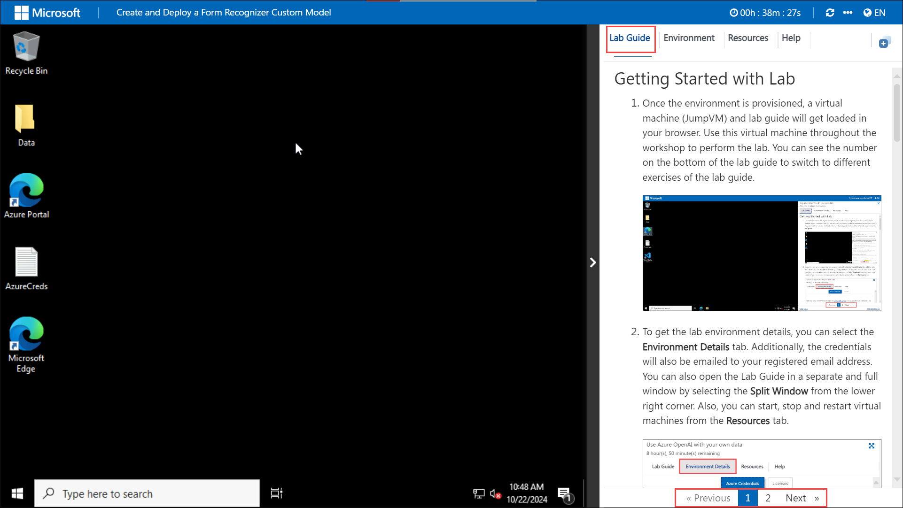
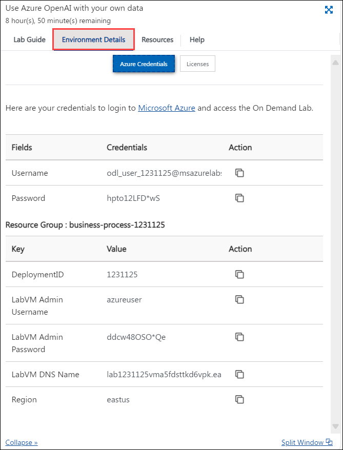

## Getting Started with Lab

1. Once the environment is provisioned, a virtual machine (JumpVM) and lab guide will get loaded in your browser. Use this virtual machine throughout the workshop to perform the lab. You can see the number on the bottom of the lab guide to switch to different exercises of the lab guide.

   
 
1. To get the lab environment details, you can select the **Environment Details** tab. Additionally, the credentials will also be emailed to your registered email address. You can also open the Lab Guide in a separate and full window by selecting the **Split Window** from the lower right corner. Also, you can start, stop and restart virtual machines from the **Resources** tab.

   
 
   > You will see the SUFFIX value on the **Environment Details** tab, use it wherever you see SUFFIX or DeploymentID in lab steps.

## Lab Validation

1. After completing the task, hit the **Validate** button under Validation tab integrated within your lab guide. If you receive a success message, you can proceed to the next task, if not, carefully read the error message and retry the step, following the instructions in the lab guide.

   

1. You can also validate the task by navigating to the **Lab Validation** tab, from the upper right corner in the lab guide section.

   

1. If you need any assistance, please contact us at labs-support@spektrasystems.com.
 
## Login to Azure Portal

1. In the JumpVM, click on the Azure portal shortcut of the Microsoft Edge browser which is created on the desktop.

   
   
1. On the **Sign in to Microsoft Azure** tab you will see the login screen, in that enter the following email/username, and click on **Next**. 

   * **Email/Username**: <inject key="AzureAdUserEmail"></inject>
   
      
     
1. Now enter the following password and click on **Sign in**.
   
   * **Password**: <inject key="AzureAdUserPassword"></inject>
   
      

1. If **Action required** pop-up window appears, click on **Ask later**.

   

1. If you see the pop-up **Stay Signed in?**, select **No**.

1. If you see the pop-up **You have free Azure Advisor recommendations!**, close the window to continue the lab.

1. If a **Welcome to Microsoft Azure** popup window appears, select **Maybe Later** to skip the tour.
   
1. Now you will see the Azure Portal Dashboard, click on **Resource groups** from the Navigate panel to see the resource groups.

   
   
1. Confirm that you have all resource groups present as shown below.

   
   
1. Verify the resources deployed in the resource group.

   
   
1. Now, click on **Next** from the lower right corner to move on to the next page.
