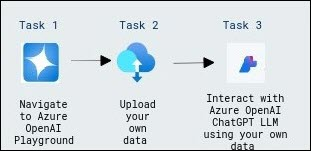

# Use Azure OpenAI with your own data

### Overall Estimated Duration: 1 hour 30 minutes

## Overview

In this lab focuses navigating to the Azure OpenAI Playground, uploading your own data, and interacting with the Azure OpenAI ChatGPT Large Language Model (LLM) to process and analyze the uploaded data, enabling advanced AI-driven insights and responses.

## Objective

Understand how to navigate the Azure OpenAI Playground, upload custom data, and interact with the Azure OpenAI ChatGPT Large Language Model (LLM) to gain advanced AI-driven insights. By the end of this lab, you will be able to:

- **Use Azure OpenAI with your own data:** Understand how to navigate the Azure OpenAI Playground, upload your own data, and interact with ChatGPT LLM to customize responses and gain insights from your data.

## Pre-requisites

- Access to Azure OpenAI chat playground.

- Sample data to test with OpenAI.

## Architecture

The architecture leverages Azure's advanced data handling tools, using Azure OpenAI Large Language Models (LLM) alongside Azure AI Search to make your data searchable and accessible. This flow integrates these components to build intelligent systems that enhance productivity and deliver personalized experiences, showcasing the powerful capabilities of Azure's AI and data analysis technologies tailored to your business needs.

## Architecture Diagram

 

## Explanation of Components

The architecture for this lab involves the following key components:

- **Azure OpenAI Playground:** Provides an interactive environment for exploring and utilizing Azure's OpenAI models, such as ChatGPT, to process and analyze your own data.

- **Uploaded Data:** Allows users to upload their own datasets into the Azure OpenAI Playground, enabling personalized AI interactions based on the data provided.

- **Azure OpenAI ChatGPT LLM:** Leverages large language models (LLM) to interact with the uploaded data, performing tasks such as data extraction, natural language understanding, and generating insights or responses from the data.

## Getting Started with Lab

1. Once the environment is provisioned, a virtual machine (JumpVM) and lab guide will get loaded in your browser. Use this virtual machine throughout the workshop to perform the lab. You can see the number on the bottom of the lab guide to switch to different exercises of the lab guide.

   

## Exploring Your Lab Resources

To get a better understanding of your lab resources and credentials, navigate to the **Environment** tab.

## Utilizing the Split Window Feature

For convenience, you can open the lab guide in a separate window by selecting the Split Window button from the top right corner.

## Lab Guide Zoom In/Zoom Out
 
To adjust the zoom level for the environment page, click the **A↕ : 100%** icon located next to the timer in the lab environment.

  

## Managing Your Virtual Machine

Feel free to start, stop, or restart your virtual machine as needed from the **Resources** tab. Your experience is in your hands!

    
    
## Login to Azure Portal and verify the pre-deployed resources

1. Open Azure Portal from the desktop by double-clicking on it.
    
   
   
1. On the **Sign into Microsoft Azure** tab, you will see the login screen, enter the following username, and, then click on **Next**.

   * **Email/Username**: <inject key="AzureAdUserEmail"></inject>

     
   
1. Now enter the following password and click on **Sign in**.
   
   * **Password**: <inject key="AzureAdUserPassword"></inject>
   
     

1. If you see the pop-up Action Required, click **Ask Later**.

    .png)

   >**NOTE:** Do not enable MFA, select **Ask Later**.

1. If you see the pop-up **Stay Signed in?**, click on **No**.

1. If you see the pop-up **You have free Azure Advisor recommendations!**, close the window to continue the lab.

1. If a **Welcome to Microsoft Azure** popup window appears, click **Cancel** to skip the tour.

1. Now you can see Azure Portal Dashboard, click on **Resource groups** from the Navigate panel to see the resource groups.

   
 
1. We have already pre-deployed all the required resources, which you will be using throughout the lab.
 
## Support Contact
 
The CloudLabs support team is available 24/7, 365 days a year, via email and live chat to ensure seamless assistance at any time. We offer dedicated support channels tailored specifically for both learners and instructors, ensuring that all your needs are promptly and efficiently addressed.

Learner Support Contacts:
- Email Support: cloudlabs-support@spektrasystems.com
- Live Chat Support: https://cloudlabs.ai/labs-support

Now, click on **Next** from the lower right corner to move on to the next page.

  

### Happy Learning!!