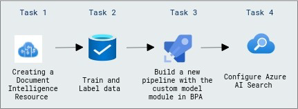

# Create and Deploy a Document Intelligence Custom Model

### Overall Estimated Duration: 1 hour

## Overview

In this lab focuses on creating and utilizing a custom Document Intelligence solution in Azure to analyze and process documents effectively. The implementation includes resource setup, model training, pipeline integration, and search optimization.

## Objective

Understand how to create and deploy an Azure AI Document Intelligence custom model in Azure, train data, and configure Azure AI Search.

**Create and Deploy a Document Intelligence Custom Model:** Understand how to streamline document data extraction and enhance efficient information retrieval by creating an Azure AI Document Intelligence resource, training data, building a custom model pipeline in BPA, and configuring Azure AI Search.

## Pre-requisites

- Familiarity with Azure’s suite of AI tools.

- Basic knowledge of BPA and how to build and manage data processing pipelines.

## Architecture

The architecture leverages Azure Document Intelligence for document analysis and data extraction. A custom project is set up with storage for training data, and the trained model is integrated into a Business Process Automation (BPA) pipeline. Azure AI Search connects to Azure Blob Storage, creating an index and indexer for efficient data processing and search. This setup enables seamless document processing, automation, and advanced search capabilities.

## Architecture Diagram

 

## Explanation of Components

The architecture for this lab involves the following key components:

- **Azure Document Intelligence:** Enables advanced document processing and analysis by creating and configuring a custom project with training data stored in Azure Blob Storage.

- **Azure Blob Storage:** Serves as the repository for storing training and test documents required for model training and evaluation.

- **Business Process Automation (BPA):** Integrates the trained custom model into workflows using the Custom Model module, automating document processing tasks and improving operational efficiency.

- **Azure AI Search:** Connects to the Blob Storage data source, enabling indexing and search capabilities. 

## Getting Started with Lab

1. Once the environment is provisioned, a virtual machine (JumpVM) and lab guide will get loaded in your browser. Use this virtual machine throughout the workshop to perform the lab. You can see the number on the bottom of the lab guide to switch to different exercises of the lab guide.

   

## Exploring Your Lab Resources

To get a better understanding of your lab resources and credentials, navigate to the **Environment** tab.

## Utilizing the Split Window Feature

For convenience, you can open the lab guide in a separate window by selecting the Split Window button from the top right corner.

## Lab Guide Zoom In/Zoom Out
 
To adjust the zoom level for the environment page, click the **A↕ : 100%** icon located next to the timer in the lab environment.

  

## Managing Your Virtual Machine

Feel free to start, stop, or restart your virtual machine as needed from the **Resources** tab. Your experience is in your hands!

    
    
## Login to Azure Portal and verify the pre-deployed resources

1. Open Azure Portal from the desktop by double-clicking on it.
    
   
   
1. On the **Sign into Microsoft Azure** tab, you will see the login screen, enter the following username, and, then click on **Next**.

   * **Email/Username**: <inject key="AzureAdUserEmail"></inject>

     
   
1. Now enter the following password and click on **Sign in**.
   
   * **Password**: <inject key="AzureAdUserPassword"></inject>
   
     

1. If you see the pop-up Action Required, click **Ask Later**.

    .png)

   >**NOTE:** Do not enable MFA, select **Ask Later**.

1. If you see the pop-up **Stay Signed in?**, click on **No**.

1. If you see the pop-up **You have free Azure Advisor recommendations!**, close the window to continue the lab.

1. If a **Welcome to Microsoft Azure** popup window appears, click **Cancel** to skip the tour.

1. Now you can see Azure Portal Dashboard, click on **Resource groups** from the Navigate panel to see the resource groups.

   
 
1. We have already pre-deployed all the required resources, which you will be using throughout the lab.
 
## Support Contact
 
The CloudLabs support team is available 24/7, 365 days a year, via email and live chat to ensure seamless assistance at any time. We offer dedicated support channels tailored specifically for both learners and instructors, ensuring that all your needs are promptly and efficiently addressed.

Learner Support Contacts:
- Email Support: cloudlabs-support@spektrasystems.com
- Live Chat Support: https://cloudlabs.ai/labs-support

Now, click on **Next** from the lower right corner to move on to the next page.

  

### Happy Learning!!